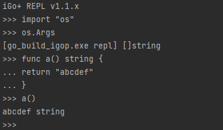

# iGo+

Golang/[Go+](https://goplus.org/) interpreter. Base on [igop v0.8.6](https://github.com/goplus/igop)

## Features

- Run a [Go+ script](https://goplus.org/)
- Run a Golang file
- Run a Golang project (3rd party modules require a vendor directory)
- Run a Golang project in the archive file of `*.tar.gz`, `*.tar.xz`, ...
- Go+ [Read-Eval-Print-Loop](https://repl.goplus.org/)

## Run Golang 

```
igop run [Path] [-V | --debug] [--vendor path] [-I | --import NAME=PATH] -- [arguments...]
```

run a [Go+ script](https://goplus.org/), or run a Golang project

|                   | Values | Default       |                                                                          |
|-------------------|--------|---------------|--------------------------------------------------------------------------|
| [Path]            | string |               | File of Golang+ script, "*.gop". <br/>Directory of Golang project.       |
| -V<br/>--debug    |        | false         | Print the debug information.                                             |
| --vendor          | string | [Path]/vendor | The path of Golang dependency packages.<br/>Generate by `go mod vendor`. |
| -I<br/>--import   |        |               | The package to be imported. `-I NAME=PATH -I NAME2=PATH2`.               |
| -- [arguments...] |        |               | Script arguments.<br/>Be read `os.Args` in the script.                   |

### Single file mode

#### Run a file with `*.gop`

```
$ igop run /path/to/file.gop 

# or
$ cd /path/to
$ igop run file.gop
```
The difference is that they have different **Working directories**

Similarly hereinafter.

> See [Example2/1.go](example2/1.gop)

#### Run a file with `*.go`

Golang file, Must include `package main` and `func main()`

```
package main

func main() {

}
```

> See [Example2/2.go](example2/2.go)

```
$ igop run /path/to/file.go 
```

### Project mode

#### No submodules, No 3rd party modules

- The package MUST be `package main` in all `.go` files 
- Included `func main()` in anyone `.go` file, or ONLY one `.gop` file
- No sub-folder. even if the sub-folders are present, they will be ignored

```
/path/to/
 - func.go
 - main.go
```

ONLY allowed one `.gop` file as the `main.go`

```
/path/to/
  - func.go
  - xxx.gop
```

Run

```
$ cd /path/to
$ igop run .

# or
$ igop run /path/to
```

#### With submodules, or 3rd party modules 

If the Golang project contains submodules, or 3rd party modules

```
/path/to
  - main.go
  - func/
    - func.go
```

MUST include these files
```
/path/to/
  - go.mod
  - vendor/             <--- if you need 3rd-party modules
    - modules.txt
```

> See [Example1/](example1)

#### - go.mod

Init the project to generate `go.mod` at first

```
$ go mod init your project-name
```

#### - `vendor` directory

Run this command to create the vendor directory, 
`igop` need to load the modules from `vendor/modules.txt`

```
$ go mod vendor
```

### Archive mode

This is a convenient way that a packaging of project mode

Supported archive format. 

- tar.gz
- tar.bzip2
- tar.xz
- zip
- tar

> See [Example1/example1.tar.gz](example1/example1.tar.gz)

When it's running, it's actually being extract to `example1/__example1.tar.gz__`

```
$ igop run examples1/example1.tar.gz --vendor vendor
```

#### `vendor`, `import` path

Unless you specify an absolute path that mean path on the OS, `--vendor` would be a relative path in archive.

Same with the PATH of `--import NAME=PATH`.

> the argument of `--vendor vendor` mean the vendor path is `examples1/__example1.tar.gz__/vendor`

Use the vendor with absolute path in OS

```
$ igop run examples1/example1.tar.gz --vendor /path/to/vendor
```

### Examples

> See  "example1/"、"example2/"

Project mode
```
$ igop run example1/

$ igop run example1/ --vendor example1/vendor

$ cd example1/
$ igop run . --vendor vendor
```

Single mode
```
$ igop run examples2/1.gop
```

Script arguments
```
$ igop run examples2/2.go -- --abc 123 --def
```

## REPL
```
igop repl
```
A [go+](https://goplus.org/) Read Eval Print Loop

online: [https://repl.goplus.org/](https://repl.goplus.org/)

